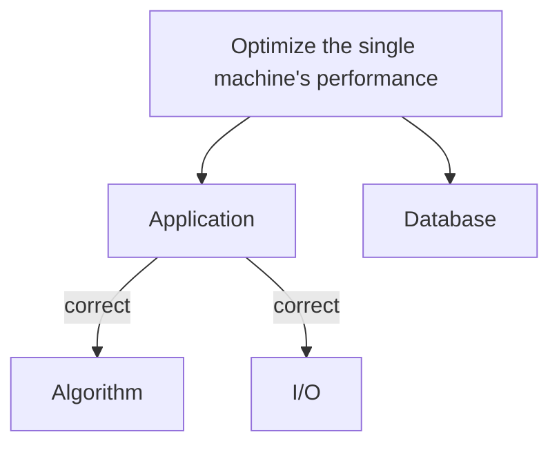

# All about System

- [Design Patterns](./design-pattern/)

## How to build a good system?

## OS

GO TO: [all-about-OS](https://github.com/chengr4/all-about-OS)

## References

- [馬克;IT 鐵人賽 2019](https://mark-lin.com/tags/it-%E9%90%B5%E4%BA%BA%E8%B3%BD-2019/)
- [System Design](https://www.karanpratapsingh.com/courses/system-design)
