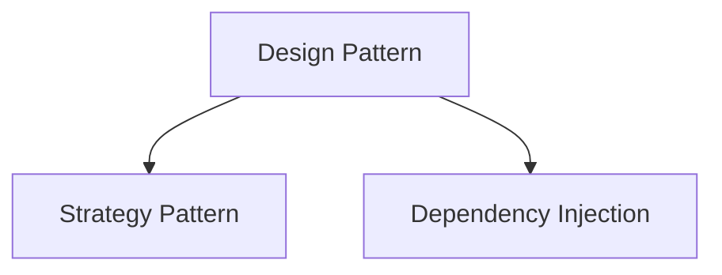

# Design Patterns

- [Strategy Pattern](#strategy-pattern)

## API Gateway Pattern

1. 有 reverse proxy
2. Decouple: 減低前後端相依程度
3. requests aggregation: 將 client 發送的 requests 在 gatway 做聚合
4. Extract common logics: 後端服務間通用的邏輯在 gateway 做處理

## Backend For Frontend Pattern (BFF)

因解決每個 device 所需資料不一樣而出現的 pattern

> One backend per User Experience: 一種裝置一種 Server

## Strategy Pattern

- Common used in web backend

## Command Patterns

- Smarthome 

## References

- [Single Responsibility Principle Explained - SOLID Design Principles (2019.12)](https://youtu.be/-ptMtJAdj40)
- [Open/Closed Principle Explained - SOLID Design Principles (2019.12)](https://youtu.be/-ptMtJAdj40)
