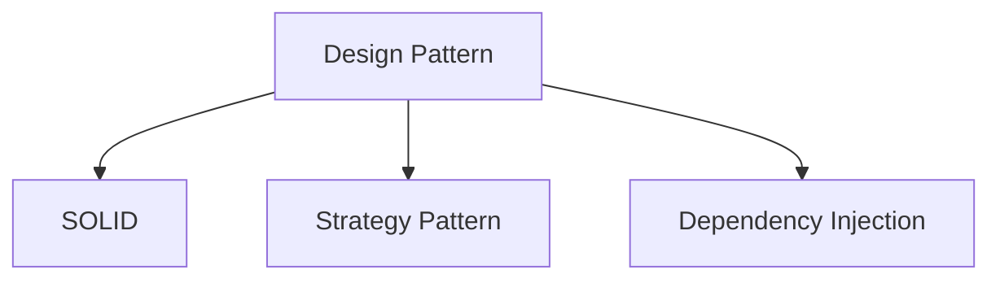

# Design Patterns

- [Strategy Pattern](#strategy-pattern)

## SOLID

- Five design principles intende to make OO designs more understandable, flexable and maintainable

### "S"ingle Responsibility Principle

- Every class, module, function should only have one single responsibility

Eg. If the class has `logMsg()` and `trackMsg()` (two responsibilities) => move `logMsg()` out of the class and import it from the place you set it.

### "O"pen/Closed Principle

- Software entities (classes, modules, functions, etc.) should be open for extension, but closed for modification
  - Open: We are able to add new things without changing the code inside the function
  - Close: The code changed outside the function should not affect the code inside the function (the code in function should not be modified)

### "L"iskov Substitution Principle

### "I"nterface Segregation Principle

### "D"ependency Inversion Principle

#### When to use

1. when seeing huge `if statement` or `switch`

## API Gateway Pattern

1. 有 reverse proxy
2. Decouple: 減低前後端相依程度
3. requests aggregation: 將 client 發送的 requests 在 gatway 做聚合
4. Extract common logics: 後端服務間通用的邏輯在 gateway 做處理

## Backend For Frontend Pattern (BFF)

因解決每個 device 所需資料不一樣而出現的 pattern

> One backend per User Experience: 一種裝置一種 Server

## Strategy Pattern

- Common used in web backend

## Command Patterns

- Smarthome 

## References

- [Single Responsibility Principle Explained - SOLID Design Principles (2019.12)](https://youtu.be/-ptMtJAdj40)
- [Open/Closed Principle Explained - SOLID Design Principles (2019.12)](https://youtu.be/-ptMtJAdj40)
